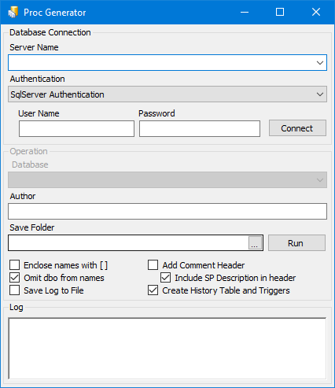

# SPGenerator
This Programming tool creates suggested sql server stored procedures for CRUD operations based on database structure

## Why was it created?
- During development I noticed most junior developers change column definition (varchar size for example) and then forget to correct it in related procedures.
- Some found it hard to create procedures especially when the task is very common such as creating add, edit, delete, get and list procedures very often.
- The time spent on creating procedures could be used in more productive places.
- To make database design faster and easier, by suggesting common procedures.
- Make a standard format for defining stored procedures.
- It is possible to use provided tools in SSMS (SQL Server Management Studio) however in each version these tools are completely modified and still user is required to write content of procedure.

## How to use
Run it and adjust configuration based on your requirement and click run.

## Settings

### Database Connection
- **Server name** : Can be selected from dropdown list or entered as IP or name with instance and port
- **Authentication**: Can be either Sqlserver or Windows, depending on which type is allowed by your server
- **Username** and **Password**: Are only used when SQL server authentication is selected.

### Operation
- **Database** : Name of database that you like to create stored procedures for it
- **Author** : If adding header comment enables, this name will be added to comment section as author of procedure
- **Save Folder** : This is where generated procedures will be saved. Note that generated files will be saved under output folder in an extra folder with selected database name will be created
- **Enclose names with [ ]** : If database has invalid SQL names such as `Finance-Income` or `database` they are required to be enclosed in [ ] to make them valid SQL names such as `[Finance-Income]` or `[database]`. This is not a good practice and it is better to rename those names as much as possible
- **Omit dbo from names** : By default all schemas are added to names, however if database design doesn't use schemas, then dbo is not required and can be ignored.
- **Save Log to file** : This will try to save log (output of application) to a document file in output folder for later diagnoses.
- **Add comment header** : If selected, a standard comment header will be added to each file
- **Include SP description in header** : This will add procedure description to header of procedure too. Description is always added as procedure comment in extended properties.
- **Create History table and Triggers** : This will create an extra history table and trigger which will allow storing modified records in another table.

**Note** : Output of this application is not meant to be used directly in development pipeline and requires to be investigated and modified if necessary by developers, hence there is no command line option is available and cannot be included as part of CI/CD pipeline.

**Note** : If tables have foreign keys, they will be used to create `ListByxxx` procedures too. For example if a table has a FK on `Parent` column, a procedure will be create as `ListByParent`.

**Note** : Five procedures will be created by default (Add,Edit,Get,Delete and List). List procedure has a max row parameter, however in some cases more filtering is required, it these cases, it is suggested to copy list procedure as Search and add the required filtering parameters manually.

**Note** : If table does not have primary key, no Delete,Get and Edit procedures will be created, even though an identity, uniqueidentifier or timestamp column is enough. This is to promote best SQL database design practices.

**Note** : Procedure names are created with `(table name)_(function)` for example `Users_Add` which is compatible with DALGenerator tool (also a repo in my git) which will increase development speed drastically.

**Note** : Application will store database connection settings in registry for ease of development process (password is encrypted), if it is required you can delete these settings from registry by using registry file included in releases.
